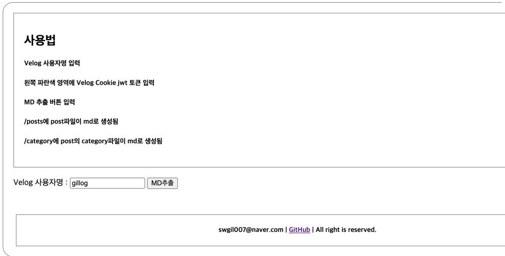
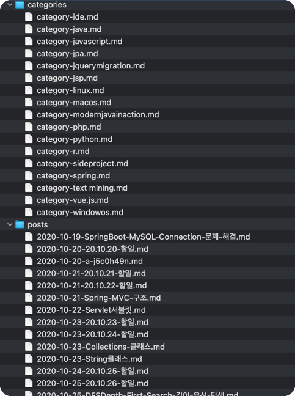
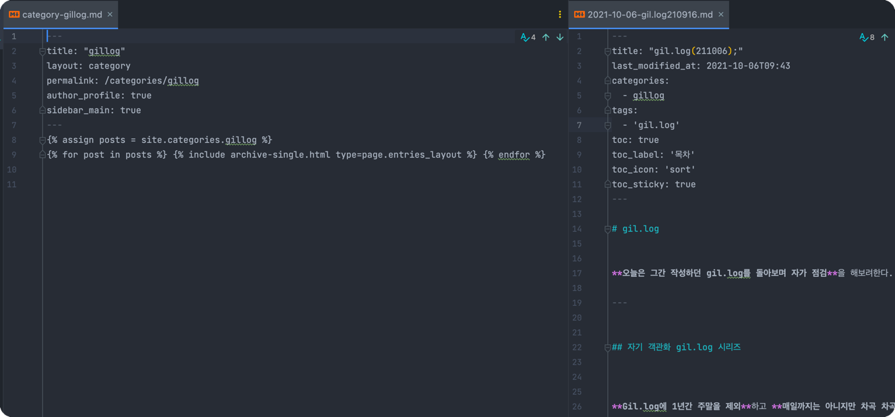

# velog_md_extractor
- Velog Post md 파일 추출기
- Velog에 특정 사용자의 작성한 Post들을 `github.io`, `jekyll`, `Minimal mistakes` Blog 에 호환 가능한 <BR> post.md, category.md 파일로 변환 하여 생성






---

# 주의사항

## 프로젝트 사용 관련

**해당 프로젝트**는 **[Velog](https://velog.io/) 사이트에 1~4초 간격으로 포스트 호출 API를 요청**하여,

**`Velog` 사이트에 부하량을 유발할 수 있는 소스임을 인지**해야 합니다.

_위대하신 Velopert님에게 허가를 받지 않음_

_23.03월 경 블로그 열람시 사용되는 API를 활용함_


**해당 프로젝트 소스 본을 타인의 블로그 글들을 Crawling 하는 용도로 사용 혹은 상업적 사용을 엄격히 금합니다.** 

_그럴 분은 없겠지만, 이런 문구를 써야 될 것 같아 남김_

개발자 본인이 `github.io`로 Velog에 작성했던 글들을 이관 하기 위한 목적으로 생성하였습니다.

## 프로젝트 미비 사항

해당 프로젝트로 변환된 파일은 하기와 같은 문제가 존재합니다.

- 생성된 `catgoery-한글카테고리명.md` 파일이 github.io와 호환되지 않는 문제
  - 한글 카테고리 page로 경로 이동 시 해당 Category Post들이 열람되지 않음

- Post 안에 `{{`, `}}` 문구가 존재할 경우 Jekyll 구동 시 컴파일 에러 발생
  - `{ {`, `} }` 식으로 문구를 나누어 주어야함, 
  - 원인 : `{{, }}`는 Gem 치환문구로 컴파일 에러 유발 

- Velog Post 제목이 너무 길 경우 생성된 `./posts`의 md 파일명을 줄여주어야함
  - [EX] : `2021-07-22-Spring-CORS-preFlightOPTIONS-Method-Interceptor-검증-로직-제외해주기Access-to-XMLHttpRequest-at-https-from-origin-https-has-been-blocked-by-CORS-policy-Response-to-preflight-request-doesnt-pass-access-control-check-It-does-not-have-HTTP-ok-status.md`

- Post 제목에 `"`가 포함되면 해당 MD 파일의 `title` 부분을 수정해주어야함
  - [EX] `title: "gil.log("211006");"` X
  - [EX] `title: 'gil.log("211006");'` O

- 이 밖에 발견되지 않은 문제 발생 가능

---

# 사용 방법

## LocalServer 구동
    
- 구동환경 : Docker

```cmd
cd ????/velog_md_extractor
docker-compose up -d
```

## main 페이지 접근

- `http://localhost/web/main.php` 접속


## Velog 닉네임 입력 후 변환 클릭
- 프로젝트 `./posts` 경로에 Velog Post들을 변환한 MD파일이 생성됨
- 프로젝트 `./categories` 경로에 Velog Post들의 Category용 MD파일이 생성됨

---

